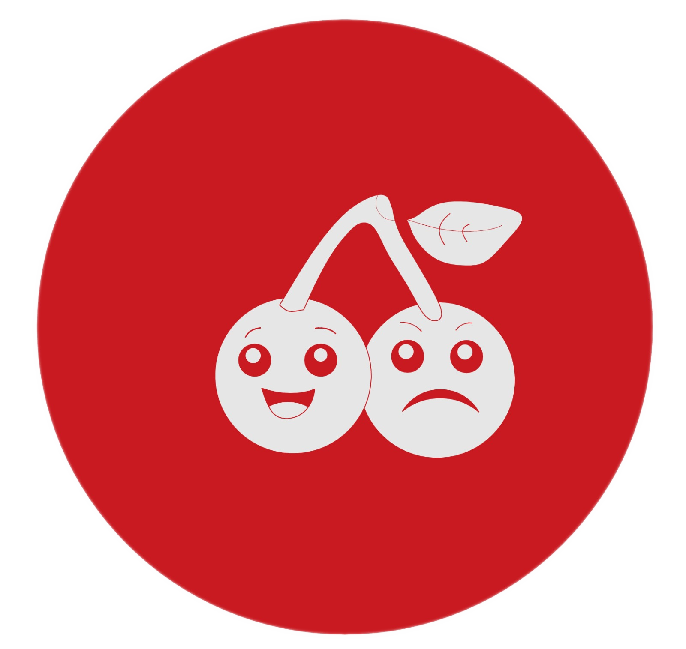
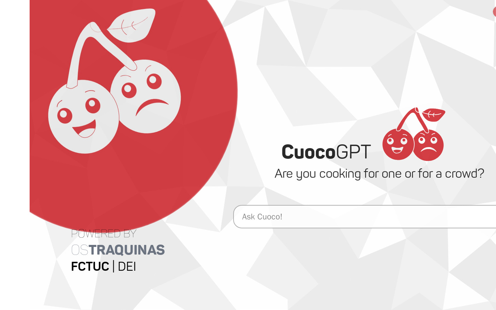
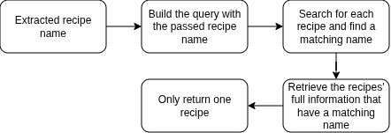
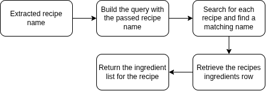
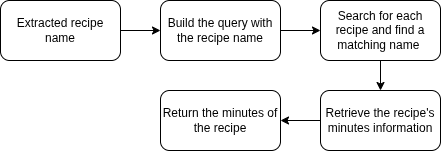
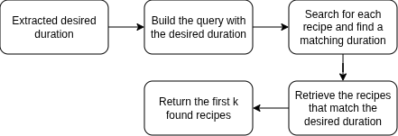
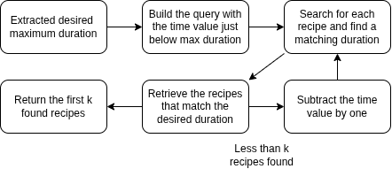
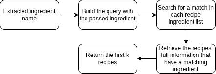
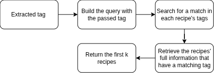
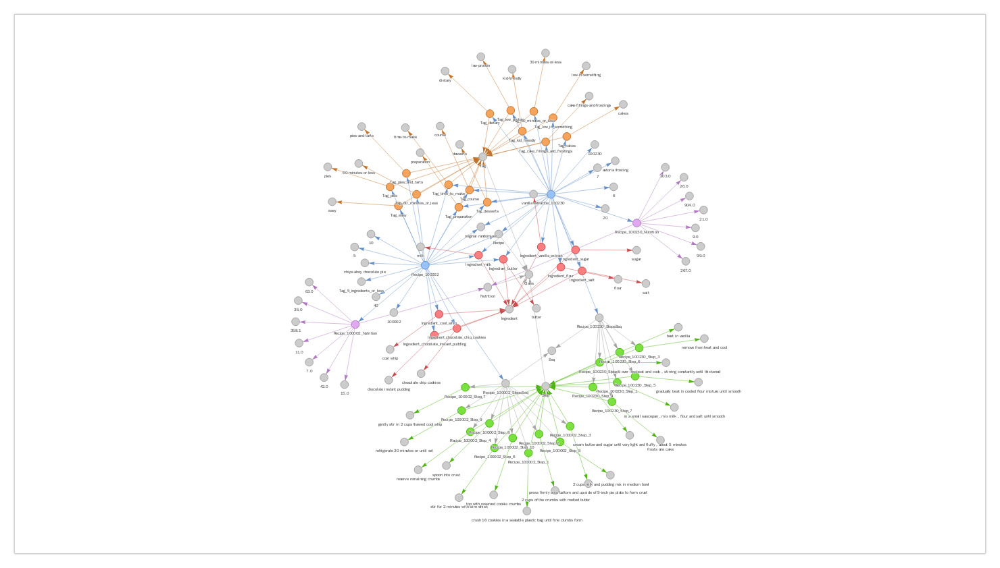

# Cuoco

Cuoco is a bilingual (Portuguese / English) recipe assistant. It answers
cooking questions by combining a curated recipe **Knowledge Graph** with a
modern NLP stack: a fine-tuned intent classifier, entity extraction and linking,
SPARQL retrieval, semantic search over recipe descriptions (RAG), and a Large
Language Model that turns the retrieved facts into a natural, language-matched
answer.

The project pairs a FastAPI backend with a React (Vite) frontend, and includes
the academic reports and literature produced alongside the system.



The chat UI, served by `npm run dev` from `frontend/`. Everything the user sees is
one input box; the intent classification, entity linking, SPARQL retrieval and
semantic search all happen behind the single `/chat` call.

## How it works

A single user query flows through the pipeline below. Everything up to the LLM
is deterministic retrieval; the LLM only phrases the answer from grounded facts.

```
User query (PT or EN)
      |
      v
Language detection + translation        (langdetect, argostranslate)
      |
      v
Intent classification                   (fine-tuned BERT: intent-bert)
      |
      v
Entity extraction + linking to the KG   (spaCy NER + fuzzy matching)
      |
      v
SPARQL retrieval over the Knowledge Graph   (rdflib, recipes_graph_cleaned.ttl)
      |
      +--> Semantic search over descriptions  (FAISS + sentence-transformers)
      |
      v
Answer generation, grounded in retrieved facts   (Groq LLM)
      |
      v
Response rendered in the chat UI (React)
```

### Supported intents

The intent classifier routes each query to one of the following, then extracts
the slots each one needs (ingredients, tags, recipe names, cooking time):

- `find_recipe` - find a specific recipe and return its full details
- `retrieve_ingredients` - list the ingredients of a named recipe
- `get_prep_time` - preparation / cooking time of a recipe
- `list_by_ingredient` - recipes that use given ingredients
- `list_by_tag` - recipes matching given tags
- `list_by_time` - recipes that fit within a time budget

Each intent has its own retrieval strategy against the Knowledge Graph. The
flowcharts below are the ones used in the final report.

**`find_recipe`** - resolve a name to exactly one recipe and return everything about it.



**`retrieve_ingredients`** - same lookup, but project only the ingredient list.



**`get_prep_time`** - the time queries split by how the user phrased the constraint:
an exact duration, an upper bound, or the plain preparation time.

| `get_prep_time` | `get_exact_time` | `get_max_time` |
| --------------- | ---------------- | -------------- |
|  |  |  |

**`list_by_ingredient`** and **`list_by_tag`** - filter the graph by extracted slots
rather than resolving a single recipe.

| `list_by_ingredient` | `list_by_tag` |
| -------------------- | ------------- |
|  |  |

## Repository structure

```
.
├── backend/                     FastAPI service and the NLP/KG/RAG pipeline
│   ├── server.py                API entrypoint (FastAPI app)
│   ├── requirements.txt         Python dependencies
│   ├── src/
│   │   ├── NLP/                 Intent classification, NER, SPARQL, pipeline
│   │   ├── RAG/                 Description embedding index + similarity search
│   │   ├── ollama/             LLM chat pipelines (Groq / Ollama) and backend glue
│   │   └── scripts/            Dataset preparation and KG visualization utilities
│   ├── data/
│   │   ├── raw/                Raw training inputs
│   │   ├── curated/           Cleaned datasets and the recipe Knowledge Graph (.ttl)
│   │   └── vector_index/       FAISS index + embeddings for RAG
│   └── models/                 Trained model artifacts (git-ignored, see Setup)
│
├── frontend/                    React + Vite chat interface ("Cuoco")
│   └── src/
│       ├── components/         UI components (chat bubbles, input bar, etc.)
│       └── assets/             Fonts, logo, and static assets
│
└── docs/                        Project documentation and academic material
    ├── project-description.pdf  Original assignment brief
    ├── reports/                LaTeX sources, PDFs, and slides
    │   ├── project-proposal/
    │   ├── literature-review/
    │   ├── final-report/
    │   ├── flowcharts/
    │   └── presentation.pdf     Project presentation slides
    ├── literature/             Reference papers
    ├── beamer-theme/           Presentation template
    └── notes.md                Working notes
```

## Prerequisites

- Python 3.10 or newer
- Node.js 18 or newer (for the frontend)
- A Groq API key (free tier works) for LLM answer generation
- Optional: a local [Ollama](https://ollama.com) install if you prefer running
  the LLM locally instead of Groq

## Setup

### 1. Backend

```bash
cd backend
python -m venv .venv
source .venv/bin/activate          # Windows: .venv\Scripts\activate
pip install -r requirements.txt

# spaCy language models used for entity extraction
python -m spacy download pt_core_news_sm
python -m spacy download en_core_web_sm
```

Configure the LLM. The Groq pipeline reads its settings from
`backend/src/ollama/groq.env`. Copy the template and add your own key:

```bash
cp src/ollama/groq.env.example src/ollama/groq.env
# then edit src/ollama/groq.env and set groq_key=...
```

`groq.env` is git-ignored, so your key stays out of version control. If you want
to run against a local model instead, copy `ollama.env.example` to `ollama.env`
and use the Ollama pipeline.

### 2. Model artifacts

The trained intent classifier and the RAG index are not committed to Git (they
are large binaries). The recipe Knowledge Graph itself
(`data/curated/recipes_graph_cleaned.ttl`) is included.

- Intent classifier: train it once with

  ```bash
  python src/NLP/train_intent_classifier.py
  ```

  This produces `backend/models/intent-bert/`. To point the pipeline at a model
  in a different location, set `INTENT_MODEL_DIR`.

- RAG description index: build it with

  ```bash
  python src/RAG/build_description_index.py
  ```

  This writes the FAISS index and embeddings under `data/vector_index/`.

### 3. Frontend

```bash
cd frontend
npm install
cp .env.example .env               # optional: change VITE_BACKEND_URL if needed
```

## Running the app

Start the backend API (from `backend/`, with the virtualenv active):

```bash
uvicorn server:app --reload --port 8000
```

Start the frontend dev server (from `frontend/`):

```bash
npm run dev
```

Then open http://localhost:5173. The UI talks to the backend at
`http://localhost:8000`.

You can also use the pipeline directly from the command line, without the web UI:

```bash
cd backend
python src/ollama/pipeline_backend.py "receitas com manteiga de amendoim"
python src/ollama/pipeline_backend.py "quick vegan pasta under 20 minutes"
```

## API

The FastAPI backend exposes:

| Method | Path      | Body                 | Response               |
| ------ | --------- | -------------------- | ---------------------- |
| GET    | `/health` | -                    | `{ status, pipeline_loaded }` |
| POST   | `/chat`   | `{ "query": "..." }` | `{ "response": "..." }` |
| POST   | `/clear`  | -                    | `{ "status": "cleared" }` |

`/chat` runs the full retrieval pipeline and returns the language-matched answer.
`/clear` resets the short conversation context the assistant keeps between turns.

## Data pipeline

The scripts under `backend/src/scripts/` document how the curated dataset and the
Knowledge Graph were built from the source recipe data:

- `dataset_merger.py`, `dataset_filter.py` - merge and clean the raw recipes
- `filter_languages.py` - keep Portuguese and English rows, drop false positives
- `dataset_sentence.py`, `dataset_tokens.py` - sentence and token views of the data
- `randomized_split.py` - train / evaluation splits
- `rdfs_maker.py` - build the RDF Knowledge Graph from the curated CSVs
- `visualization.py`, `small_visualization.py` - render the KG to HTML



A two-recipe slice of the graph `rdfs_maker.py` produces, rendered by
`small_visualization.py` to
[`backend/data/curated/kg_visualization.html`](backend/data/curated/kg_visualization.html)
(open it in a browser for the interactive version). Recipes are blue, ingredients
red, tags orange, preparation steps green and nutrition facts purple. The shape is
what makes the SPARQL retrieval work: ingredients and tags are shared nodes, so
`list_by_ingredient` and `list_by_tag` are a single hop from an entity the NER
stage linked, while `retrieve_ingredients` and `get_prep_time` are one hop the
other way from a resolved recipe.

## Documentation

The `docs/` folder holds the assignment brief, the project proposal, the
literature review, the final report (LaTeX sources and compiled PDFs), and the
project presentation slides, plus the reference papers used during the project.

## Authors

- Miguel Castela
- Miguel Martins

DEI, Universidade de Coimbra.
