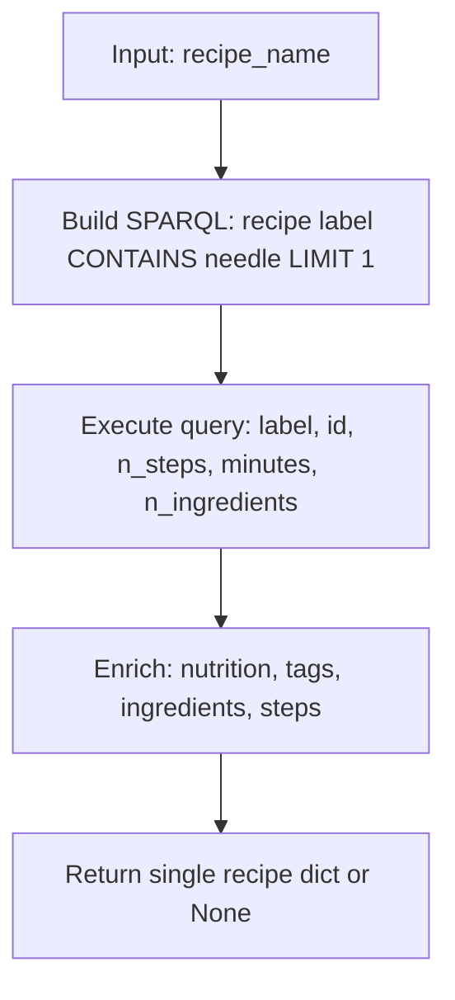
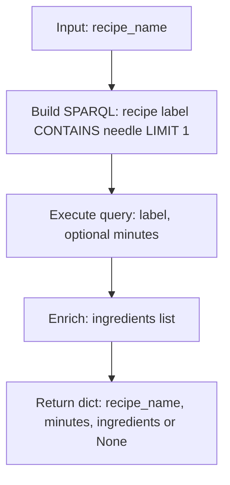

# Intent Flowcharts (Entity Extraction → SPARQL → Pre-backend)

Below are Mermaid flowcharts for each intent, starting from the output of entity extraction, through the SPARQL query phase, and ending just before handing off to `pipeline_backend.py`.

## list_by_ingredient

```mermaid
flowchart TD
  A[User query] --> B[SpaCy pipeline]
  B --> C{extract_candidates}
  C --> D[candidate_chunks]
  C --> E[cooking_time: None]
  C --> F[max_minutes: None]
  D --> G[link_candidates_to_kg(intent=list_by_ingredient)]
  G --> H[ingredients: fuzzy match via KGIndex.search]
  H --> I[_cap_scored_list limit=10]
  I --> J{Have ingredient matches?}
  J -- yes --> K[Build request payload]
  J -- no --> L[Empty list]
  K --> M[SPARQL: query_list_by_ingredient(graph, ingredient_name, top_k=5)]
  L --> M
  M --> N[Results: recipe_name, n_steps, minutes, nutrition, tags, ingredients, steps]
  N --> O[Return to pipeline (pre-backend handoff)]
```

## list_by_tag

```mermaid
flowchart TD
  A[User query] --> B[SpaCy pipeline]
  B --> C{extract_candidates}
  C --> D[candidate_chunks]
  D --> E[link_candidates_to_kg(intent=list_by_tag)]
  E --> F[tags: KGIndex.search + time-tag synonyms]
  F --> G[_cap_scored_list limit=10]
  G --> H{Have tag matches?}
  H -- yes --> I[Build request payload]
  H -- no --> J[Empty list]
  I --> K[SPARQL: query_list_by_tag(graph, tag_name, top_k=5)]
  J --> K
  K --> L[Results: recipe_name, n_steps, minutes, nutrition, tags, ingredients, steps]
  L --> M[Return to pipeline (pre-backend handoff)]
```

## find_recipe

```mermaid
flowchart TD
  A[User query] --> B[Detect language]
  B --> C[translate_between for secondary pass]
  A --> D[SpaCy primary]
  D --> E{extract_candidates(primary)}
  C --> F[SpaCy secondary]
  F --> G{extract_candidates(secondary)}
  E --> H[link_candidates_to_kg(intent=find_recipe)]
  G --> I[link_candidates_to_kg(intent=find_recipe)]
  H --> J[primary recipe_name: exact/containment; else fuzzy]
  I --> K[secondary recipe_name: exact/containment; else fuzzy]
  J --> L[_merge_scored_lists(primary, secondary)]
  K --> L
  L --> M{Have recipe match?}
  M -- yes --> N[Build request payload]
  M -- no --> O[None]
  N --> P[SPARQL: query_find_recipe(graph, recipe_name)]
  O --> P
  P --> Q[Result: recipe_name, id, minutes, n_steps, n_ingredients, nutrition, tags, ingredients, steps]
  Q --> R[Return to pipeline (pre-backend handoff)]
```

## retrieve_ingredients

```mermaid
flowchart TD
  A[User query] --> B[Detect language]
  B --> C[translate_between for secondary pass]
  A --> D[SpaCy primary]
  D --> E{extract_candidates(primary)}
  C --> F[SpaCy secondary]
  F --> G{extract_candidates(secondary)}
  E --> H[link_candidates_to_kg(intent=retrieve_ingredients)]
  G --> I[link_candidates_to_kg(intent=retrieve_ingredients)]
  H --> J[primary recipe_name]
  I --> K[secondary recipe_name]
  J --> L[_merge_scored_lists(primary, secondary)]
  K --> L
  L --> M{Have recipe match?}
  M -- yes --> N[Build request payload]
  M -- no --> O[None]
  N --> P[SPARQL: query_retrieve_ingredients(graph, recipe_name)]
  O --> P
  P --> Q[Result: recipe_name, minutes, ingredients]
  Q --> R[Return to pipeline (pre-backend handoff)]
```

## get_prep_time

```mermaid
flowchart TD
  A[User query] --> B[SpaCy pipeline]
  B --> C{extract_candidates}
  C --> D[candidate_chunks]
  D --> E[link_candidates_to_kg(intent=get_prep_time)]
  E --> F[recipe_name: exact/containment; else fuzzy]
  F --> G{Have recipe candidates?}
  G -- yes --> H[Build request payload]
  G -- no --> I[Empty]
  H --> J[SPARQL: query_get_prep_time(graph, recipe_name, top_k=5)]
  I --> J
  J --> K[Results: recipe_name, time_uri?, minutes]
  K --> L[Return to pipeline (pre-backend handoff)]
```

## list_by_time

```mermaid
flowchart TD
  A[User query] --> B[SpaCy pipeline]
  B --> C{extract_candidates}
  C --> D[cooking_time (exact minutes) | max_minutes (range)]
  D --> E[link_candidates_to_kg(intent=list_by_time)]
  E --> F{Exact minutes?}
  F -- yes --> G[SPARQL: query_by_exact_minutes(graph, minutes_list)]
  F -- no --> H{Max minutes?}
  H -- yes --> I[SPARQL: query_by_max_minutes(graph, max_minutes)]
  H -- no --> J[No time constraint → Empty]
  G --> K[Results: recipes with matching minutes]
  I --> K
  J --> K
  K --> L[Return to pipeline (pre-backend handoff)]
```

Notes
- Entity extraction stages referenced: `extract_candidates`, `link_candidates_to_kg`, language detection and translation, and KG searches.
- SPARQL functions referenced from `backend/src/NLP/sparql_queries.py`.
- This documentation ends just before payloads are sent to `backend/src/ollama/pipeline_backend.py`.

## query_list_by_ingredient (Compact)

```mermaid
flowchart TD
  A[Input: ingredient_name, top_k] --> B[Build SPARQL: recipes with ingredient label CONTAINS needle]
  B --> C[Execute query: recipe label, n_steps, optional minutes]
  C --> D[For each row: parse minutes; enrich nutrition, tags, ingredients, steps]
  D --> E[Return list of recipe dicts (≤ top_k)]
```

## query_list_by_tag (Compact)

```mermaid
flowchart TD
  A[Input: tag_name, top_k] --> B[Build SPARQL: recipes with tag label CONTAINS needle]
  B --> C[Execute query: recipe label, n_steps, optional minutes]
  C --> D[For each row: parse minutes; enrich nutrition, tags, ingredients, steps]
  D --> E[Return list of recipe dicts (≤ top_k)]
```

## query_find_recipe (Compact)



## query_retrieve_ingredients (Compact)



## query_get_prep_time (Compact)

```mermaid
flowchart TD
  A[Input: recipe_name, top_k] --> B[Build SPARQL: OPTIONAL hasTime/minutes; COALESCE to minutes]
  B --> C[Execute query: label, time_uri?, minutes]
  C --> D[Normalize minutes (int/float/string → value or None)]
  D --> E[Return list of dicts (≤ top_k)]
```

## query_by_exact_minutes (Compact)

```mermaid
flowchart TD
  A[Input: minutes_list] --> B[Flatten + validate minutes; return [] if empty]
  B --> C[Build SPARQL: FILTER xsd:integer(?minutes) IN (...)]
  C --> D[Execute query: recipe, label, minutes]
  D --> E[Enrich: nutrition, tags, ingredients, steps; return list]
```

## query_by_max_minutes (Compact)

```mermaid
flowchart TD
  A[Input: max_minutes] --> B[Validate; return [] if None]
  B --> C[Build SPARQL: minutes < max_minutes AND > 0 ORDER BY DESC(?minutes)]
  C --> D[Execute query: recipe, label, minutes]
  D --> E[Enrich: nutrition, tags, ingredients, steps; return list]
```
